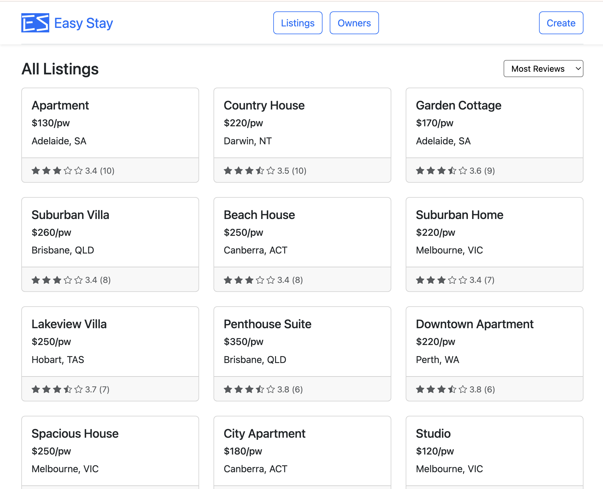
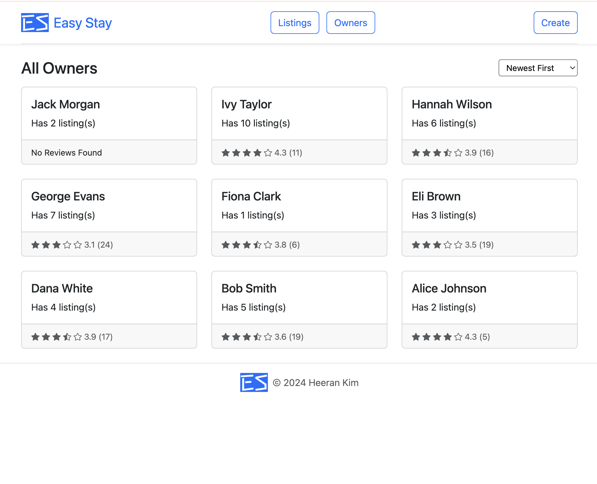
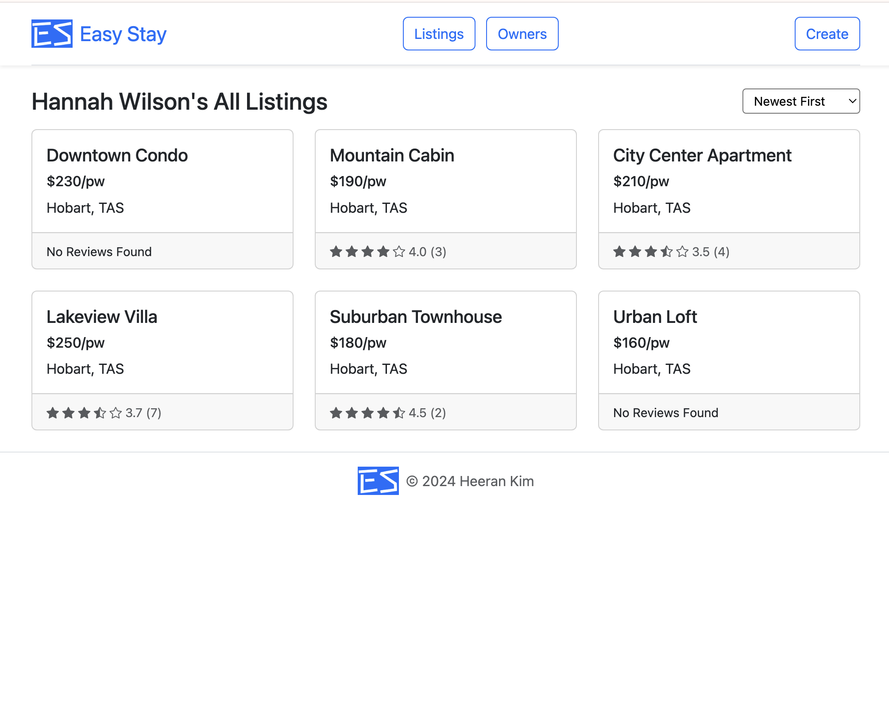
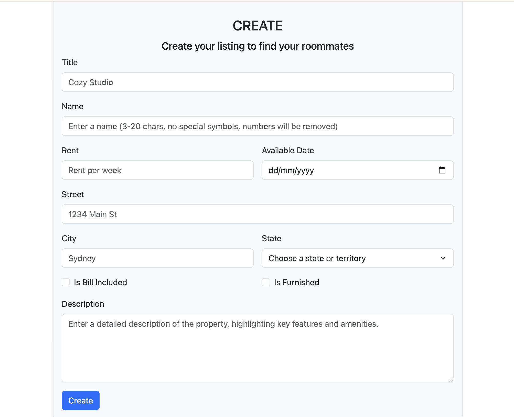
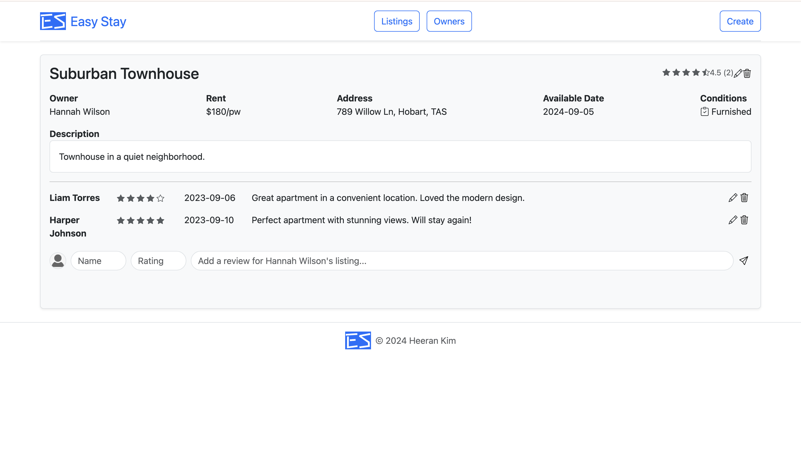
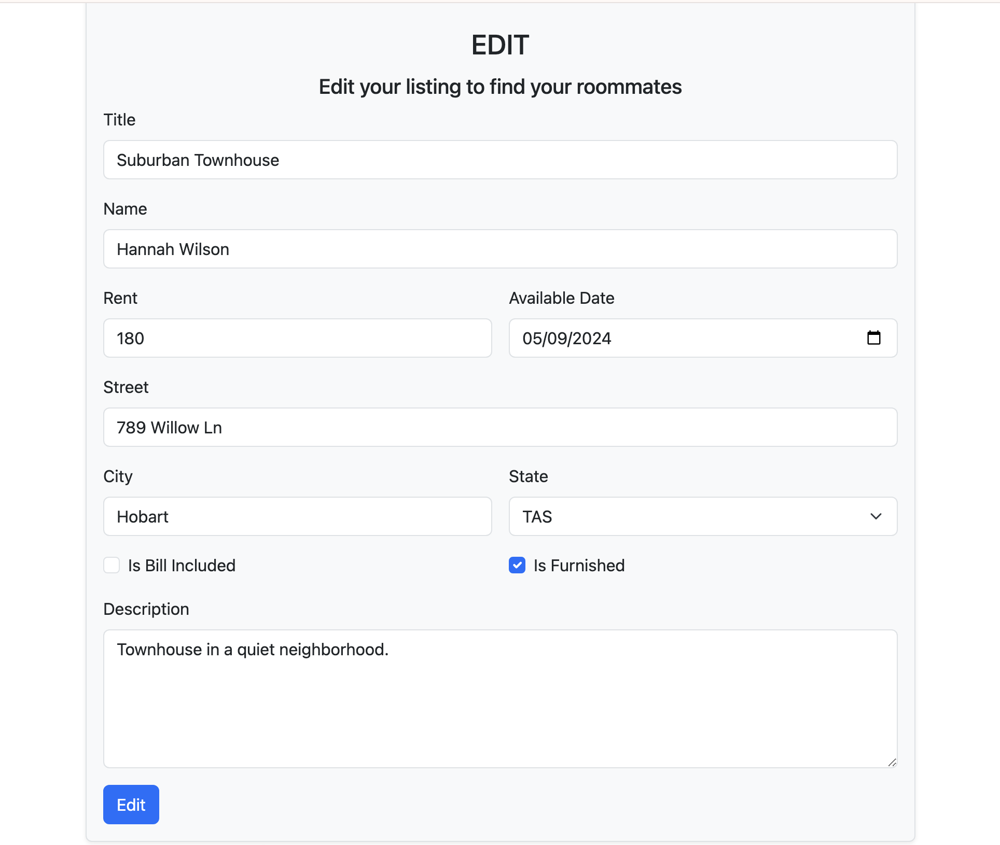
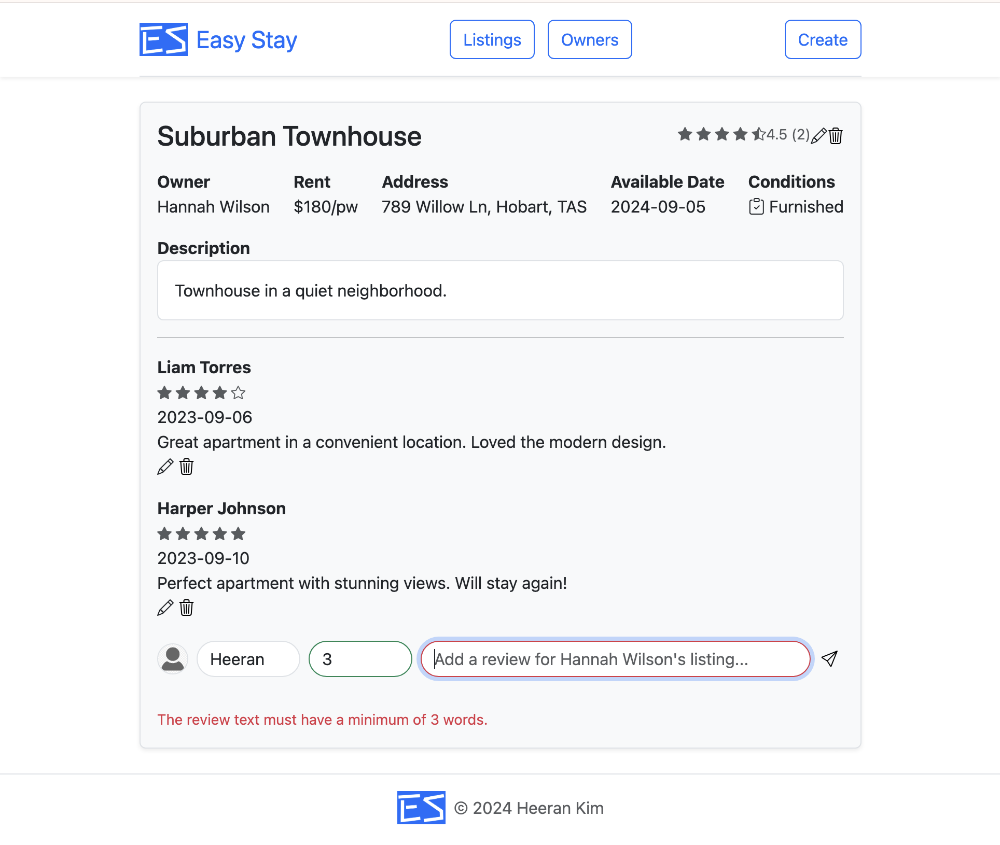
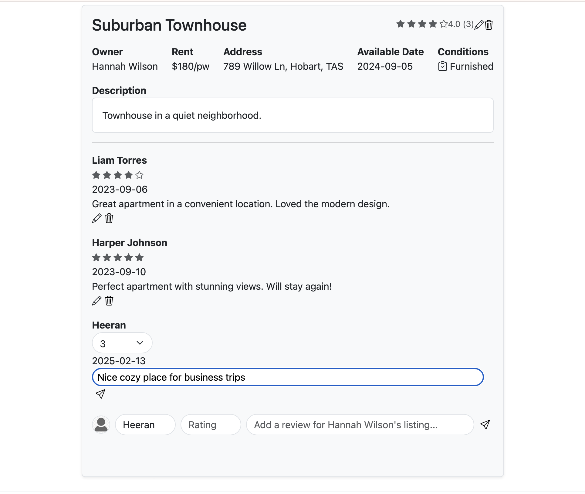
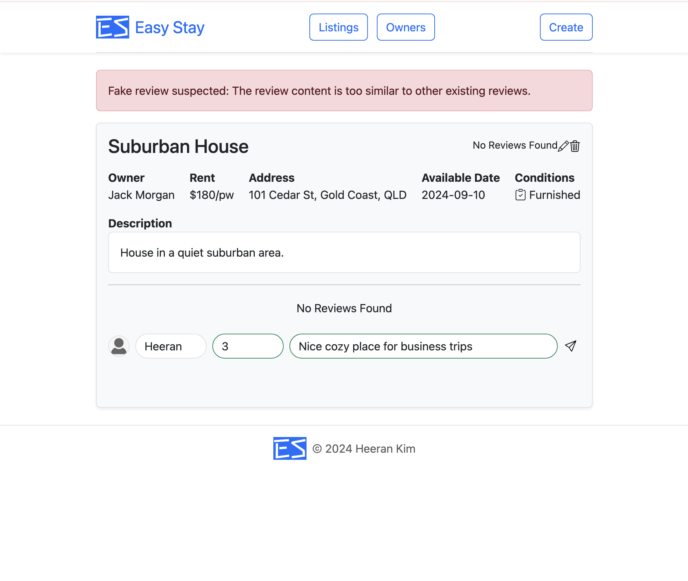

# 🏡 EasyStay - Rental Review Platform

## 📌 Project Overview
EasyStay is a **lightweight rental review platform** built with **Laravel**, featuring **basic CRUD functionality without models or controllers**.

This project was built with strict constraints,  
**only using raw SQL queries** and **Blade templating** for front-end rendering.  

- **No Eloquent ORM** → All database interactions use **raw SQL queries**.  
- **No Controllers or Models** → Routing and logic are handled in `web.php`.  
- **No Laravel Validation** → Custom input validation was implemented.  

For a more advanced project with authentication, role-based access control,  
and a fully structured MVC architecture, check out **[this project](https://github.com/heeran-kim/classmate-web)**.

## 🎯 Features
- 🔍 **Browse Listings**: View rental properties, prices, locations, and user reviews.
- 🏡 **Owner-Based Listings**: View rental properties grouped by owner and see all listings by a specific owner. Each owner’s rating is dynamically calculated based on the average rating of their properties.
- 🏡 **Manage Listings**: Property owners can create, edit, and delete listings.
- 📝 **User Reviews**: Renters can submit and manage reviews with ratings (1-5) and comments.
- 🛠 **Sorting & Filtering**: Listings can be sorted by review count, location or average rating.
- 🔄 **Session-Based User Memory**: Reviewers' names persist using Laravel Sessions for future reviews.
- ⚡ **Client-Side & Server-Side Validation**: Manual input validation is performed both in the frontend (JavaScript) and backend (PHP) without Larevel's built-in validation.
- 🔎 **Fake Review Detection**: Implemented methods to help identify fake reviews.

## 🛠 Tech Stack
- **Backend**: Laravel (Routing & Views only, No Models/Controllers)
- **Database**: SQLite (Accessed via raw SQL queries)
- **Frontend**: Blade Templates, Bootstrap 5
- **Security**: Manual input validation, SQL sanitization, and XSS prevention

## 📸 Preview
| Listings Overview | Owners Overview | Owner's Listings |
|-|-|-|
|  |  |  |

| Create Listing | View Listing | Edit Listing |
|-|-|-|
|  |  |  |

| Create Review | Edit Review | Fake Review Detection |
|-|-|-|
|  |  |  |

## 📂 Core Project Structure
```text
easystay/
├── database/           # Raw SQL scripts for table creation & seeding
├── public/             # Public assets (CSS, images)
├── resources/          # Views (Blade templates)
└── routes/             # Web routes (web.php - Handles all logic)
```

## 🚀 Setup & Installation
1️⃣ Clone the Repository
```bash
git clone https://github.com/heeran-kim/easystay-web.git
cd easystay-web
```
2️⃣ Install Dependencies
```bash
composer install
npm install && npm run dev
```
3️⃣ Set Up Environment
```bash
cp .env.example .env
php artisan key:generate
```
4️⃣ Run Migrations & Seed Database
```bash
php artisan migrate --seed
```
5️⃣ Start the Server
```bash
php artisan serve
```
Now, visit http://127.0.0.1:8000 in your browser! 🎉

## 🏆 Future Improvements
- 📊 **Admin Dashboard**: Provide an interface for managing properties and reviews including approving or removing flagged reviews.
- 📍 **Location-Based Filtering**: Enhance search functionality using maps and geolocation.
- 🏡 **Property Image Upload**: Allow property owners to upload images to showcase their listings.
- 🤖 **AI Review Analysis**: Implement machine learning to detect fake reviews.
- 📅 **Booking System**: Implement a booking feature for renters.

